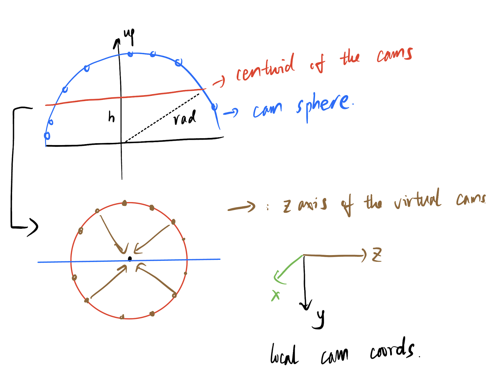

<style type="text/css">
    h1 { counter-reset: h2counter; }
    h2 { counter-reset: h3counter; }
    h3 { counter-reset: h4counter; }
    h4 { counter-reset: h5counter; }
    h5 { counter-reset: h6counter; }
    h6 { }
    h2:before {
      counter-increment: h2counter;
      content: counter(h2counter) ".\0000a0\0000a0";
    }
    h3:before {
      counter-increment: h3counter;
      content: counter(h2counter) "."
                counter(h3counter) ".\0000a0\0000a0";
    }
    h4:before {
      counter-increment: h4counter;
      content: counter(h2counter) "."
                counter(h3counter) "."
                counter(h4counter) ".\0000a0\0000a0";
    }
    h5:before {
      counter-increment: h5counter;
      content: counter(h2counter) "."
                counter(h3counter) "."
                counter(h4counter) "."
                counter(h5counter) ".\0000a0\0000a0";
    }
    h6:before {
      counter-increment: h6counter;
      content: counter(h2counter) "."
                counter(h3counter) "."
                counter(h4counter) "."
                counter(h5counter) "."
                counter(h6counter) ".\0000a0\0000a0";
    }
</style>

# Summary of the NeRF Code

## Coordinate Transformations


<center>Different Coordinate Systems</center>

There are multiple coordinate systems with different definitions used in the codes as shown in the above figure. First, to convert colmap coords to LLFF coords, the coordinates should be multiplied with the rotation matrix $R_{col}^{LLFF}$:

$$
X_{LLFF}=R_{col}^{LLFF}X_{col}=
    \begin{bmatrix}
    0&1&0\\
    1&0&0\\
    0&0&-1
    \end{bmatrix}X_{col}
$$

Then similar transforamtion is applied from LLFF to OpenGL/NeRF coordinate system:

$$
X_{NeRF}=R_{LLFF}^{NeRF}X_{LLFF}=
    \begin{bmatrix}
    0&1&0\\
    -1&0&0\\
    0&0&1
    \end{bmatrix}X_{LLFF}
$$

The above $R_{LLFF}^{NeRF}$ is implemented by the code in the function *load_llff_data()* in *load_llff.py*:

```python
#!/usr/bin/env python3
poses = np.concatenate([poses[:,1:2,:], -poses[:,0:1,:], poses[:,2:,:]], 1)
```

****Note that the z+ direction is opposite to the camera view in NeRF coords.***

## Image Preprocessing

***Prior: the data structure***

The raw data from pose_bounds.npy is the information about the camera extrinsics and intrinsics. Each row has 17 elements with the first 12 elems as the 3x4 extrinsics, the 13-15th elems as the intrinsics ( image high, image width and the focal length. The principal point is assumed as centered and the focal length is the same for both x and y axes.) and the 16-17th elems the depth boundary (near/far) of the scene captured by the corresponding image. After reshaped the first 15 elems from $[N,15]$ to $[N,3,5]$, the info matrix $M_{raw}$ of each image is as follow:

$$
    M_{raw}=\begin{bmatrix}
    R_{3x3}&t_{3x1}&hwf_{3x1}
    \end{bmatrix}=\begin{bmatrix}
    P_{3x4}&hwf_{3x1}\end{bmatrix},
$$
where $P_{3x4}=[R_{3x3},t_{3x1}]$ is the extrinsic matrix/camera pose and $hwf$ the intrinsics.

### Image Resizing

**Reason**: If the input image size is too large, the amount of generated rays to be trained is also too large, making the time consumption on network training unacceptable with little performance improvement. Therefore, the raw images need to be resized , or so-called '*downsampled*' before further operations.
This process is conducted in *_load_data()*.

### Scene Rescaling

***Reason:*** to normalize the scene structure in a proper depth distribution (not numerically too far or too close that may effect the network training). Around from 1 to far.

```python
#!/usr/bin/env python3
sc = 1. if bd_factor is None else 1./(bds.min() * bd_factor)
poses[:,:3,3] *= sc
bds *= sc
```

If bd_factor is given, the depth is first normalized by *bds_min()* and then scaled by bd_factor. The similar process to the translation part in pose matrix.

***//TODO: why the translation part is also scaled?***

### Position Recentering

***Reason:*** to find the central location of the poses of input images. It acts as a regulation for the following optimization. Besides, this recentering also helps to generate the spiral/shpere render path when validating the algorithm.

#### Details

***Prior:*** for a matrix representing the camera to world coordinate transformation $[R,t]_{3x4}$, the three columns of the rotation matrix $R$ actually are the directions of $X,Y,Z$ axes of the camera coords at the world coords, respectively.

The main steps are as below:

- Get the average translation $\bar{t}=t.mean()$
- Get the average z (backward) and y (up) direction $\bar{Z}$ and $\bar{Y}$ by $\bar{Z}=z.mean(), \bar{Y}=y.mean()$;
- Get the third average x direction $\bar{X}$ by cross product: $\bar{X} = cross(\bar{Y}, \bar{Z})$;
- Normalize the above three avg vectors to get the final avg camera transformation $T_{c}^{\bar{c}}$:

$$
T_{w}^{\bar{c}} = \begin{bmatrix}
    \bar{X}_n&\bar{Y}_n&\bar{Z}_n&\bar{t}\\
    \bold{0}&\bold{0}&\bold{0}&1
\end{bmatrix}
$$

- Right multiply the avg camera pose to get the ***relative transformation*** from the ***center*** to the ***camera poses*** in the world coordinates:  $T^{c}_{\bar{c}}=T_{w}^{c}(T_w^{\bar{c}})^{-1}=T_{\bar{c}}^cT_{w}^c(T_w^{\bar{c}})^{-1}$

Or in other words, the world origin moves to the center with x-y-z axes the same directions.

### Render Path Generation

#### Spiral Path for Looking-Forward Scene

If the *spherify* param is not activated, then the render path will be generated as a spiral-like path. This trajectory is controled by several params. Please refer to the codes since this part is intuitive.

#### Spherical Path for Spherically Captured Scene

If the scene is captured spherically, the render path should also be spherical. The main steps are as below:

- Find the point that minimizes the sum of distances between the point to the local z direction of each image pose. (See *[here](https://github.com/bmild/nerf/issues/121)* for the mathematical derivation of *min_line_dist()*.)
  
  This step is to find the focus of the image set. For example, if these images try to capture an object, then the point will be located at this object as shown in the following figure.

  <div align=center></div>

- Use this center point to 1) generate a transformation matrix with its $z$ axis towards from the avg image position to the center point we get in the last step and its translation the center point itself; 2) further normalize the camera poses by the transformation matrix. the corresponding codes are:

    ```python
    center = pt_mindist
    up = (poses[:,:3,3] - center).mean(0)

    vec0 = normalize(up)
    vec1 = normalize(np.cross([.1,.2,.3], vec0))
    vec2 = normalize(np.cross(vec0, vec1))
    pos = center
    c2w = np.stack([vec1, vec2, vec0, pos], 1)

    poses_reset = np.linalg.inv(p34_to_44(c2w[None])) @ p34_to_44(poses[:,:3,:4])
    ```

    After normalization, the camera poses are the relative poses w.r.t the center point and the generated axis $c2w$.

  **The vector [.1,.2,.3] is arbitrarily chosed, only to form a coordinate system that has the z axis point upwards. [ref. source](https://github.com/bmild/nerf/issues/64).* 

- Obtain the approximate avg radiance of the image sphere as shown in the following picture, and then again normalize the translation and depth boundary by the radiance.
  <div align=center></div>
  <center>The demonstration of camera sphere</center>

  The corresponding codes:

  ```python
  rad = np.sqrt(np.mean(np.sum(np.square(poses_reset[:,:3,3]), -1)))
    
  sc = 1./rad
  poses_reset[:,:3,3] *= sc
  bds *= sc
  rad *= sc
  ```

- Generate the final circle path as shown below:
  <div align=center></div>
  <center>Circle path generation</center>

  The corresponding code implementation:

  ```python
    centroid = np.mean(poses_reset[:,:3,3], 0)
    zh = centroid[2]
    print("spherify_poses: centroid={}, rad={}".format(np.around(centroid,5),rad))
    radcircle = np.sqrt(rad**2-zh**2)
    new_poses = []
    
    for th in np.linspace(0.,2.*np.pi, 120):

        camorigin = np.array([radcircle * np.cos(th), radcircle * np.sin(th), zh])
        up = np.array([0,0,-1.])

        vec2 = normalize(camorigin)
        vec0 = normalize(np.cross(vec2, up))
        vec1 = normalize(np.cross(vec2, vec0))
        pos = camorigin
        p = np.stack([vec0, vec1, vec2, pos], 1)

        new_poses.append(p)
  ```

## Ray Sampling Strategy Analysis

To fully understand the ray sampling strategy, especially when to sample the points along the rays in normalized device coords or in inverse depth (disparity), the related coordinate transformations and boundary scaling opearations need to be understood first.

### Coordinate Transformations in OpenGL

*Please see *[this page](http://www.songho.ca/opengl/gl_projectionmatrix.html)* and *[this page](http://www.songho.ca/opengl/gl_transform.html)* for more detailed definitions and derivations in this section.


<center>Coordinates transformation in OpenGL</center>

The normalized device coordinates (ndc) is used for point samping when rendering the rays. To get the ndc coordinates, an object must be transfomed from object coords to eye coords, and then from eye coords to clip coords, finally the ndc.

#### Eye Coords to Clip Coords

The eye coords is the same as the camera coords with z direction forward or backward. If the boudnaries of the scene are cut, then the eye coords becomes clip coords:

<div align=center></div>
<center>Clip Coordinates</center>

The terms $l, r, t, b, n, f$ represent the left/right/top/bottom/near/far boundaries of the scene. The final transformation from eye to clip coords $P_c=M_{e2c}P_e$ is as below:

$$
\left[\begin{matrix}
    x_c\\y_c\\z_c\\w_c
\end{matrix}\right]=
\left[\begin{matrix}
    \frac{n}{r}&0&0&0\\
    0&\frac{n}{t}&0&0\\
    0&0&\frac{-(f+n)}{f-n}&\frac{-2fn}{f-n}\\
    0&0&-1&0
\end{matrix}\right]
\left[\begin{matrix}
    x_e\\y_e\\z_e\\w_e
\end{matrix}\right]
$$

The $w_e$ is set to be 1. Then

$$
\begin{matrix}
z_c=-\frac{f+n}{f-n}\cdot z_e-2\frac{fn}{f-n},&z_e\in (-n,-f)
\end{matrix}
$$

#### Normalized Device Coordinate

If the clip coords is normalized by $w_c=-z_e$, here comes the final normalized device coordinate (**ndc**):

$$
P_n=\left[\begin{matrix}
    x_n\\y_n\\z_n
\end{matrix}\right]=-\frac{1}{z_e}\cdot 
\left[\begin{matrix}
    x_c\\y_c\\z_c
\end{matrix}\right]=
\left[\begin{matrix}
    \frac{-nx_e}{rz_e}\\
    \frac{-ny_e}{rz_e}\\
    \frac{f+n}{f-n}+\frac{2fn}{f-n}\cdot \frac{1}{z_e}
\end{matrix}\right]
$$

The range of all elems in $P_n$ is (-1,1). That is to say, the scene in the clip coords (perspective view) is remapped into a unit cube, as shown in the following figure. This coordinate transformation is linear mapping (projection), which means the lines are preserved.

<div align=center></div>
<center>Clip to ND Coords</center>

### Ray Projection in the NDC Situation

If the param *args.ndc* is set to True, the rays $\bold{o}+t\bold{d}$ in the original world coordinate will be projected to the normalized device coordinates $\bold{o}'+t'\bold{d}'$ (see [here](https://github.com/bmild/nerf/files/4451808/ndc_derivation.pdf) for the formula derivation).

Breifly speaking, this ray projection tries to:

- move the origin $\bold{o}$ onto the plane $z=1$ in NDC coordinate;
- the points one a ray ($t\in (0,+\infty)$) are projected into the unit cube, wihch means points at infinity will be end at $z=1$ in NDC coordinates ($t'\in (0,1)$).

The final fomula is expressed as:
$$
\bold{o}'+t'\bold{d}'=\bold{\pi}(\bold{o}+t\bold{d})
$$
where $\bold{\pi}$ is the projection matrix $M_{e2c}$ given [before](#eye-coords-to-clip-coords). If we print the output of the function *ndc_rays()*, we can see that the *ray_o* is like this form:

```python
#print the output
print('ndc_rays: rays_o={}'.format(rays_o))

#OUTPUT
ndc_rays: rays_o=[[ 1.5837601   1.7007993  -1.        ]
 [-2.0751164   1.4614655  -1.0000002 ]
 [-0.9452096   3.191392   -1.0000002 ]
 ...
 [-0.8296989  -2.926006   -1.0000002 ]
 [-0.41826704  1.700375   -1.0000002 ]
 [ 0.46754944  2.6667976  -1.        ]]
```

showing that the origins of the projected rays all fall onto the plane $z=-1$.

### Tracking the Boundary Scaling

In the codes, the near and far depth of the scene are scaled several times. For the analysis of ndc/lindisp, these scaling operations need to be tracked.

- First, the near/far boundaries are obtained from the pose_boundary.npy at *_load_data()* (see [this chapter](#definition-of-the-depth-in-colmap) for details about the definition of depth used in colmap).
- Then the boundaries are scaled by bd_factor:

    ```python
    sc = 1. if bd_factor is None else 1./(bds.min() * bd_factor)
    bds *= sc
    ```

    Then the range of bds is around **<font color=Green>(1.25,...)</font>** if bd_factor=0.75 as default.

Now the bds are scaled according to two different sampling strategies.

- ***No_NDC + Spherify + Lindisp for 360 Scenes***: The bds are first scaled in *[spherify_poses](#spherical-path-for-spherically-captured-scene)*, then scaled at *train()*
  
  ```python
  if args.no_ndc:
    near = tf.reduce_min(bds) * .9
    far = tf.reduce_max(bds) * 1.
  ```

- ***NDC for Looking-forward Scenes***: The bds are reset to **<font color=Green>(0,1)</font>** because in this situation, the scene is squeezed into a [unit cube](#normalized-device-coordinate) with each dimension varies from (-1,1) and then the scalar of the points at a ray are projected into [$(0,1)$](#ray-projection-in-the-ndc-situation).

### Samping Linearly in NDC OR Inverse Depth

With so mauch aformentioned preknowledge introduced in this note, here comes the core problem that I'm concerend and confused me for a long time: **<font color=Red>what's the difference between ndc and no_ndc ray sampling strategies in terms of the network performance?</font>**

If the number of sampled points is $M$ and index $m \in [1,M]$ denotes the $m^{th}$ sampled point, the mathematical expression of this two samping ways are:

- **ndc-forward**: 
  
  $$
  z_{(s,m)}^n=2\frac{m}{M}-1=\frac{f+n}{f-n}+\frac{2fn}{f-n}\cdot \frac{1}{z_{(s,m)}^e}
  $$
  
  where $z_{(s,m)}^n$ is the $m^{th}$ sampled points in the ndc coords, $z_{(s,m)}^e$ is the corresponding point in the original camera coords. The right side equation comes from [here](#normalized-device-coordinate).

- **no_ndc-sphere**: 
  
  $$
  z_{(s,m)}^d=\frac{1-m/M}{n}+\frac{m/M}{f}=\frac{1}{z_{(s,m)}^e}
  $$

Then the sampled point in the original cam coords with different sampling strategies can be summaried as:

$$
z_{(s,m)}^e=\begin{cases}
    \frac{1}{\frac{1-m/M}{n}+\frac{m/M}{f}}, & for\ no\_ndc\ \\
    \frac{-2fn}{(f-n)(2m/M-1)-(f+n)}, & for\ ndc
\end{cases}
$$

Acturally these two expressions ***are the same*** (the depth of ndc is multplied with -1 for demonstration):

<div align=center></div>

Does this mean that ndc/no_ndc is useless? **<font color=Red>*No at all*</font>**. See the experiment results using my own collected datasets:


#### Experiments on Self-collected Datasets

- The dest dataset is **looking-forward type**. The params of the left one are ndc=ture, spherify=false, lindisp=false. The params of the right one are ndc=false, spherify=false, lindisp=ture. Both with 150K iterations.
  
<div align=center></div>

- The chair dataset is **shperically captured type**. The params of the left one are ndc=ture, spherify=true, lindisp=false with even **more than 200K** iterations. The params of the right one are ndc=false, spherify=ture, lindisp=ture with **just 100K** iterations. 
  
<div align=center></div>

We can see that 1) for the looking-forward scene, ndc makes a texture prediction with higher performance (especially at the marginal area). 2) for the second type, ndc instead fails the network.

#### Analysis

First, the 5D input of the network is the sampled rays which is defined by its orientation and position. At first, the *get_rays()* or *get_rays_np()* in *run_nerf_helpers.py* constructs the rays in images using the camera intrinsics and **reprojects** them into the **world coordinate**. Then the network samples points along the rays in the scene boundary obtained from the [pose_boundary.npy](#definition-of-the-depth-in-colmap). Therefore, the network naturally **encodes the scene in the world coordinate** in a certain way.

- For the looking-forward scene, because the scene is unbounded, the *far* parameter could be too far away from the camera origin. It may make the high frequency part useless in [position encoding](#position-encoding), and consequently produce grainy results in the background as shown above (the marginal part of the video). Therefore, the author <font color=Red>reprojects</font> **the scene in the world** into **the scene in the normalized device coordinates**, by which the depth of the unbounded scene is restricted into $(0,1)$ to avoid the problem. (see [here](https://github.com/bmild/nerf/issues/18) for the author's explaination). 
  
  After reprojection, the 3d points in the world coords that are approximately far away from the poses of this cams are scaled, which means the scene is **deformed**.
  The **finally encoded scene** is the **deformed scene** in ndc coords.

- For the spherically captured scene, if the scene is also reprojected into ndc coords, a severe problem would emerge that, if we equally cut the scene into two parts, **the transformation $world$->$ndc$ on each side wants to squezee the scene on the other side**. This ambiguity would confuses the network to encode the scene and finally the network performance is dramatically decreased.
  
  ***//TODO: A more detailed interpretation about the overlapping phenomenon in the output.***

## Appendix

### Definition of the depth in colmap

The pose_boundary.npy is the output of the following function named *save_poses()<-pose_utils.py<-[LLFF](https://github.com/Fyusion/LLFF)*. LLFF is a previous work of NeRF's author **also in the field of view synthesis**.

```python
def save_poses(basedir, poses, pts3d, perm):
    pts_arr = []
    vis_arr = []
    for k in pts3d:
        pts_arr.append(pts3d[k].xyz)
        cams = [0] * poses.shape[-1]
        for ind in pts3d[k].image_ids:
            if len(cams) < ind - 1:
                print('ERROR: the correct camera poses for current points cannot be accessed')
                return
            cams[ind-1] = 1
        vis_arr.append(cams)

    pts_arr = np.array(pts_arr)
    vis_arr = np.array(vis_arr)
    print( 'Points', pts_arr.shape, 'Visibility', vis_arr.shape )
    
    zvals = np.sum(-(pts_arr[:, np.newaxis, :].transpose([2,0,1]) - poses[:3, 3:4, :]) * poses[:3, 2:3, :], 0)
    valid_z = zvals[vis_arr==1]
    print( 'Depth stats', valid_z.min(), valid_z.max(), valid_z.mean() )
    
    save_arr = []
    for i in perm:
        vis = vis_arr[:, i]
        zs = zvals[:, i]
        zs = zs[vis==1]
        close_depth, inf_depth = np.percentile(zs, .1), np.percentile(zs, 99.9)
        # print( i, close_depth, inf_depth )
        
        save_arr.append(np.concatenate([poses[..., i].ravel(), np.array([close_depth, inf_depth])], 0))
    save_arr = np.array(save_arr)
    
    np.save(os.path.join(basedir, 'poses_bounds.npy'), save_arr)  
```

We can see that this line actually defines the depth in the pose_boundary.npy:

```python
zvals = np.sum(-(pts_arr[:, np.newaxis, :].transpose([2,0,1]) - poses[:3, 3:4, :]) * poses[:3, 2:3, :], 0)
```

which in nature projects the 3D points in the world coords into the $z$ axis of the camera coords:

$$
z_c=-(P_w-t)\cdot r_3
$$

where $z_c$ is the depth of the 3d point in the cam coords, $P_w$ is the point's 3D location in the world coords, and $t$ the translation part of the transform matrix $T_w^c$. Therefore, $P_w-t$ represents the relative position of the point to the cam in the world coords. The $r_3$ is the $3^{rd}$ col of the rotation matrix in $T_w^c$. Recall in [position recentering](#details), we say that $r_3$ is the unit vector representing the z axis of the local camera coords in the world coords. Therefore, this product actually gets the projection of the relative position on $z_{cam}$. The minus sign is introduced because of the coordnates transformation from colmap to LLFF as mentioned at the [start](#coordinate-transformations) of this note.

**<font color=Red>The metric of the local cam coords and the world coords are the same. for example, if the $z_w=5$ means 5 meters away from the world origin in z axis, then the $z_c=3$ means 3 meters depth.</font>**

### Position Encoding
